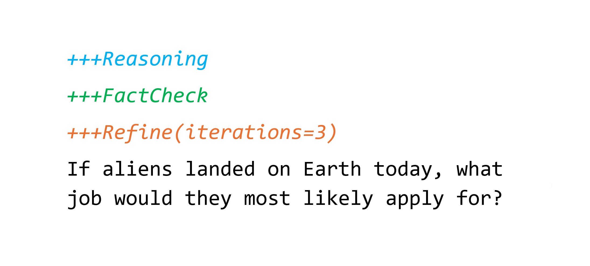

# Prompt Decorators



Artificial intelligence is an incredibly powerful tool, but the quality of its responses often depends on how effectively we communicate with it. If you have ever struggled to get a precise, well-structured answer from an AI model, you are not alone. Many users face inconsistencies, vague responses, or excessive trial-and-error in prompt formulation. What if there was a way to standardize and refine AI outputs effortlessly?

**Enter Prompt Decorators**—a simple yet powerful approach that enhances AI responses using structured prefixes. By guiding AI with standardized instructions, Prompt Decorators help ensure that answers are clear, logical, and well-organized. Whether you are a researcher, developer, marketer, or casual user, this technique will save you time and frustration while unlocking AI’s full potential.

## 1. Introduction: The Challenge of AI Prompting

AI models have revolutionized how we interact with technology, enabling automated content generation, research assistance, and problem-solving. However, the effectiveness of AI-generated responses depends significantly on how prompts are structured. Many users encounter common challenges when interacting with AI:

1. **Ambiguous prompts lead to unpredictable responses.**

   - AI models generate answers based on statistical patterns rather than deep understanding. A vague prompt like *"Explain machine learning"* can lead to a broad range of responses, from a beginner-friendly definition to an advanced technical discussion.

2. **Overly detailed prompts are cumbersome and inconsistent.**

   - Users often attempt to compensate for AI unpredictability by writing excessively detailed prompts, but this does not always lead to consistently structured responses.

3. **Effective prompt engineering is not intuitive.**

   - Crafting precise prompts requires experience, and minor changes in wording can significantly impact AI responses. Without a standardized method, users struggle to get the desired output efficiently.

To address these issues, **Prompt Decorators**—structured prefixes that refine AI responses in a systematic way—offer a straightforward yet powerful solution.

## 2. Introducing Prompt Decorators (`+++`)

Inspired by Python decorators, **Prompt Decorators** allow users to modify AI behavior using simple prefixes at the start of a prompt. They offer a standardized way to structure AI responses without the need for lengthy instructions.

### Why `+++` Instead of `@`?

In Python, `@` symbol is used to apply decorators to functions and classes. On the other hand, many online platforms and tools also use `@` for tagging users and agents, making it an impractical choice for AI prompting. To avoid conflicts and ensure clarity, I chose `+++` as a distinct and intuitive prefix for Prompt Decorators.

### Example of Prompt Decorators in Action

This is a normal prompt without decorators:

```
Suggest a name for an AI YouTube channel focused on AI/ML video tutorials.
```

We can enhance this prompt using `+++Reasoning` decorator to ensure the AI provides a logical explanaion:

```
+++Reasoning
Suggest a name for an AI YouTube channel focused on AI/ML video tutorials.
```

This forces the AI to provide a structured explanation before suggesting names. It encourages the AI to think critically and provide a rationale for its response.

Additionally, it is possible to combine multiple decorators to refine AI responses further. For example:

```
+++Refine(iterations=3)
+++Reasoning
Suggest a name for an AI YouTube channel focused on AI/ML video tutorials.
```

This prompt instructs the AI to refine its response through three iterations, ensuring a logical explanation is provided.

Using `+++`, users can enforce structured responses **without lengthy, complex instructions**.

## 3. Key Prompt Decorators and Their Benefits

| **Prompt Decorator**             | **Function**                                       |
| -------------------------------- | -------------------------------------------------- |
| `+++Reasoning`                   | Ensures logical explanation before answering       |
| `+++StepByStep`                  | Breaks down complex tasks into steps               |
| `+++Debate`                      | Generates multiple perspectives                    |
| `+++Critique`                    | Analyzes strengths and weaknesses before improving |
| `+++Refine(iterations=N)`        | Iterates through multiple refinements              |
| `+++CiteSources`                 | Ensures AI includes references                     |
| `+++FactCheck`                   | Prioritizes verifying factual accuracy             |
| `+++OutputFormat(format=FORMAT)` | Structures the response in a specified format      |
| `+++Tone(style=STYLE)`           | Enforces a specific tone                           |

Each decorator plays a crucial role in improving AI interactions by enforcing structured and well-thought-out responses.

## 4. Prompt Decorators Definitions

The detailed definitions of each Prompt Decorator are provided in the [`prompt-decorators.txt`](./prompt-decorators.txt) file, located in the repository.

It is important to note that this is not an ideal implementation, and others may find better ways to define and use these Prompt Decorators. The current approach is simply a realization of the idea - a way to enable users to define structured directives and reuse them efficiently in their daily AI interactions.

## 5. Learn More

To dive deeper into the concept of Prompt Decorators and how they can enhance AI interactions, check out the detailed article on Medium:\
**[Read the full article HERE.](https://kalami.medium.com/prompt-decorators-a-simple-way-to-improve-ai-responses-c3f3c2579a8c)**

## 6. Contribution & Licensing

Contributions to expand or refine these decorators are welcome. If you have suggestions, feel free to submit a pull request.

This repository is distributed under the **MIT License**. See [`LICENSE`](./LICENSE) for details.
